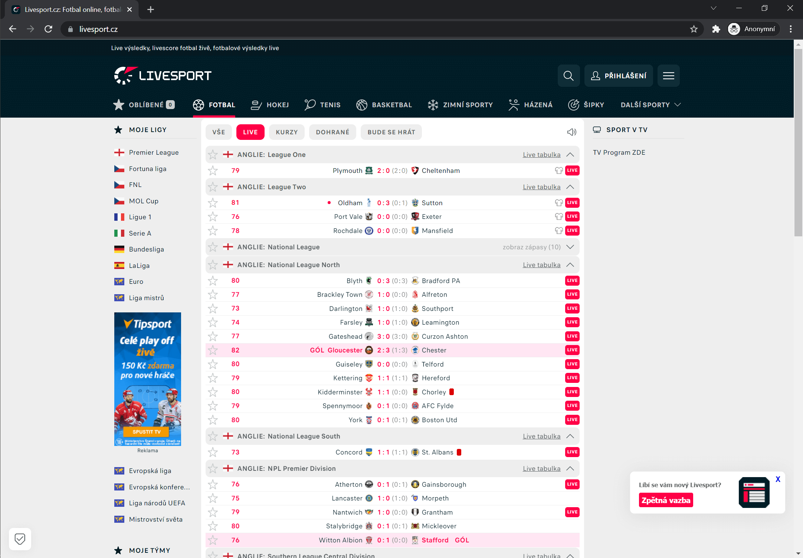

# Livesport-One-line-Football - Google Chrome Extension

## _Football match scores packed in one simple line instead of two_ ⚽

Livesport.cz, a popular site for sports scores, changed its look a few weeks ago. I built this expansion because I prefer the earlier, simpler one row layout. You can compare the screenshots below. Only football matches are affected by this extension; no other sports are modified.

  
⬆️ The image above shows a design layout with this extension active.  
⬇️ The bottom image shows the ordinary design of Livesport.cz without any visual modifications.

> Note: The speed of this extension depends on how many football matches you have opened. If you want swifter reactions then hide matches from leagues you are not interested in.
